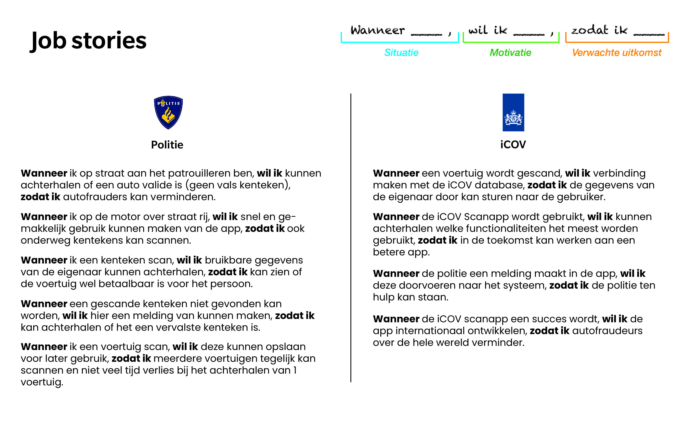

# Job stories

Bij Job Stories is het belangrijk dat je elke ontwerp-probleem kadert in een soort van taak. Hierbij richt je je eerst op de gebeurtenis of situatie (wanneer...), vervolgens op de motivatie en het doel (wil ik...), en ten slotte op het gewenste resultaat (zodat ik...).

 (1) (1) (1) (1).png>)

## Politie

* **Wanneer** ik op straat aan het patrouilleren ben, **wil ik** kunnen achterhalen of een auto valide is (geen vals kenteken), **zodat ik** autofraudeurs kan verminderen.
* **Wanneer** ik op de motor over straat rij, **wil ik** snel en gemakkelijk gebruik kunnen maken van de app, **zodat ik** ook onderweg kentekens kan scannen.
* **Wanneer** ik een kenteken scan, **wil ik** bruikbare gegevens van de eigenaar kunnen achterhalen, **zodat ik** kan zien of de voertuig wel betaalbaar is voor het persoon
* **Wanneer** ik een kenteken scan die al eerder gescand is door een collega, **wil ik** kunnen zien waar en wanneer dit heeft plaatsgevonden, **zodat ik** kan achterhalen dat het geen gedupliceerde kenteken is.
* **Wanneer** ik een kenteken scan, **wil ik** deze kunnen opslaan voor later gebruik, **zodat ik** meerdere voertuigen tegelijk kan scannen en niet veel tijd verlies bij het achterhalen van 1 voertuig.

## iCOV

* **Wanneer** een voertuig wordt gescand, **wil ik** verbinding maken met de iCOV database, **zodat ik** de gegevens van de eigenaar door kan sturen naar het persoon wie de scan heeft uitgevoerd.
* **Wanneer** de iCOV Scanapp wordt gebruikt, **wil ik** kunnen achterhalen welke functionaliteiten het meest wordt gebruikt (en welke niet), **zodat ik** de app ideaal kan maken voor de gebruiker
* **Wanneer** de politie een melding maakt in de app, **wil ik** deze doorvoeren naar het systeem, **zodat ik** de politie ten hulp kan staan.
* **Wanneer** de iCOV Scanapp een handige middel wordt om autocriminaliteit te verminderen, **wil ik** de app internationaal ontwikkelen, **zodat ik** autocriminaliteit over de hele wereld kan verminderen.

