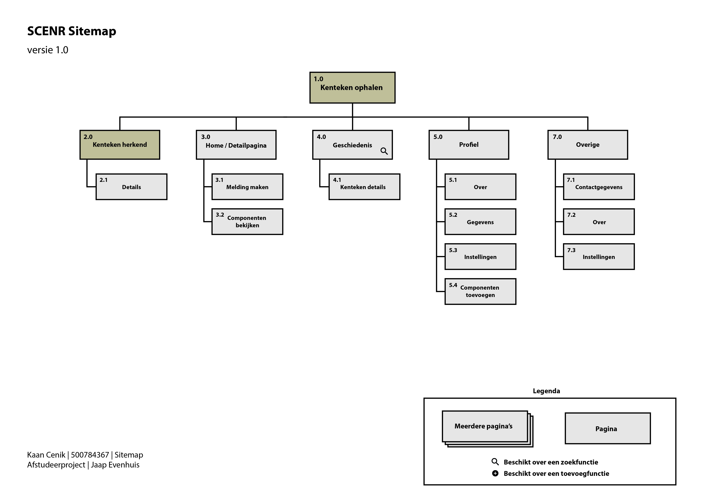
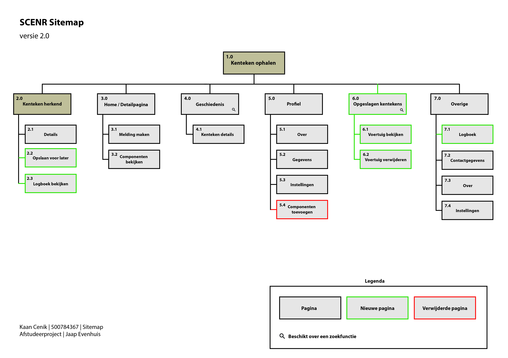

# Sitemap

Om de huidige tool in kaart te kunnen brengen en aan te geven waar mijn project focus lig en welke schermen ik tijdens mijn afstudeerproject zal gaan ontwerpen heb ik een eerste versie van een sitemap gemaakt. Een _sitemap_ is een diagram met daarop een lijst van alle pagina's die op een website / applicatie te vinden zijn.

### Versie 1

Na alle feedback, interviews en onderzoek zijn er in de applicatie een paar nieuwe pagina's van pas gekomen (en weggehaald). Hiervoor dus een 2e versie van de sitemap:

### Versie 2

