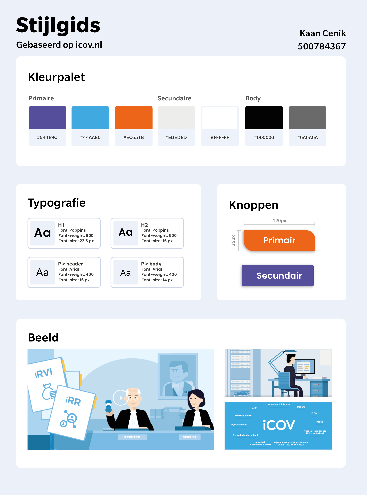
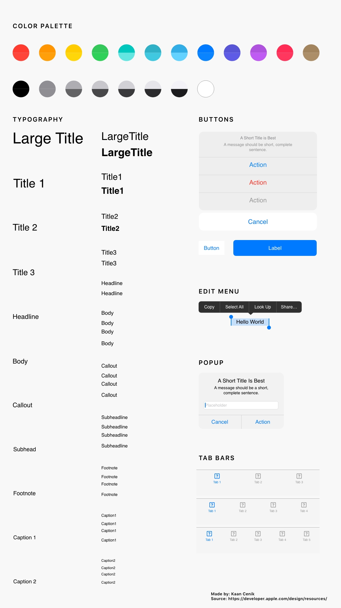

# Stijlgids

### iCOV

Omdat de app vanuit iCOV wordt ontwikkeld is het belangrijk dat de kleuren en lettertypes herhaaldelijk erin terug voorkomen. Daarom heb ik eerst een stijlgids gemaakt die gebaseerd is op de [iCOV website](https://www.icov.nl).

### IOS

Omdat de app gemaakt wordt op een IOS-systeem, leek het me handig om ook hier een stijlgids op te maken. Deze zal me helpen bij de keuzes die ik maak in de app en wanneer ik welke element moet toepassen.

