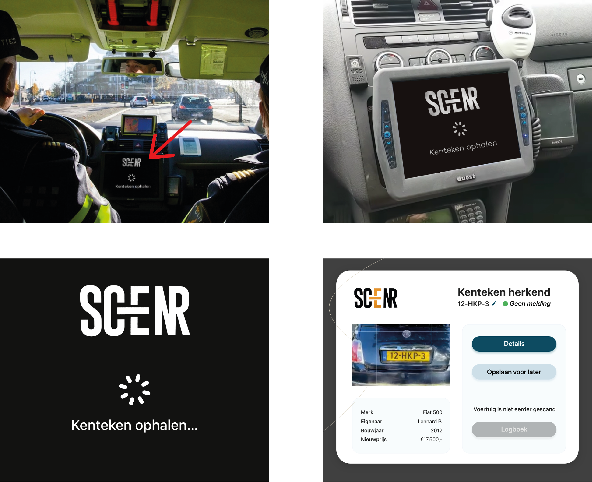
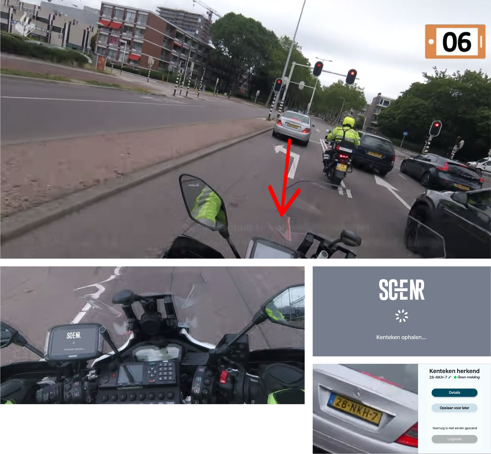
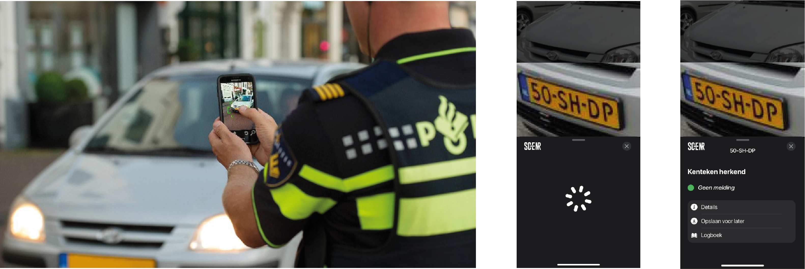

# Ideeën generatie

Een kenteken kan op verschillende manieren doorgevoerd worden naar de SCENR app.

1. Handmatig invoeren
2. Een camera die tekst herkend
3. Met spraak (via de mobilofoon)
4. Met gebaren

In mijn concepten hieronder heb ik voor de camera optie gekozen. Sinds dit een nieuwe functie is bij mobiele telefoons en jarenlang op (o.a.) snelwegen wordt gebruikt, is het handig meegenomen voor ook de Politie. Nadat zij een voertuig scannen, wordt deze vervolgens doorgevoerd naar de SCENR app om daar dan meer informatie over de bestuurder te weten te komen. Ook kunnen er verschillende technieken gebruikt worden om te achterhalen of een voertuig gestolen of (kentekenplaat) gedupliceerd is.

## Concept 1 - Agent in auto

Een agent in een politie auto/bus kan tijdens het rijden de opdracht geven om een kentekenplaat te scannen. Zo'n camera zou zich dan in de dashboard (dashcam) kunnen bevinden of onder de binnenspiegel. Nadat een kenteken is opgehaald, wordt hiervan de details weergeven. De agent kan vervolgens kiezen wat hij met deze data wil doen. De werking hiervan gaat ongeveer zo:

## Concept 2 - Motoragent

Bij een motoragent moeten er op een aantal extra dingen gelet worden. Eén daarvan is bijvoorbeeld dat de handelingen die hij/zij kan uitvoeren minder is dan bij een agent in een auto of op voet. Een motor gaat namelijk vooruit door een draaibeweging te maken met je rechterhand, wat ervoor zorgt dat die hand al niet gebruikt kan worden om handelingen uit te voeren voor een scan. Er moet zoveel mogelijk gehandeld worden met de linkerhand, wat ook wel de steunhand is tijdens het besturen van een motor. In het concept hieronder moet je via de scherm aangeven wat je met de scan van de kenteken wil gaan doen (details bekijken, opslaan, etc.). Voor een motoragent kan dit nogal een lastige taak zijn als hij op een hoge snelheid aan het rijden is. Daarom is het handig om onderzoek te doen op mogelijkheden die dit makkelijker kan maken. Kijk hiervoor in het kopje [Werking van de App](../../het-product/scenr-app/werking-van-de-app.md).

## Concept 3 - Agent op voet

Een agent op voet heeft natuurlijk meer tijd en ruimte dan de andere soorten. Voor hen is het doorvoeren van een kentekenplaat veel gemakkelijker. Zij kunnen dit via een mobiel doen door met de camera een kenteken vast te leggen. Ook zou het handmatig of met spraak doorgevoerd kunnen worden. Dit gaat ongeveer zo in zijn werking:

## Concept 4 - Alle soorten agenten

