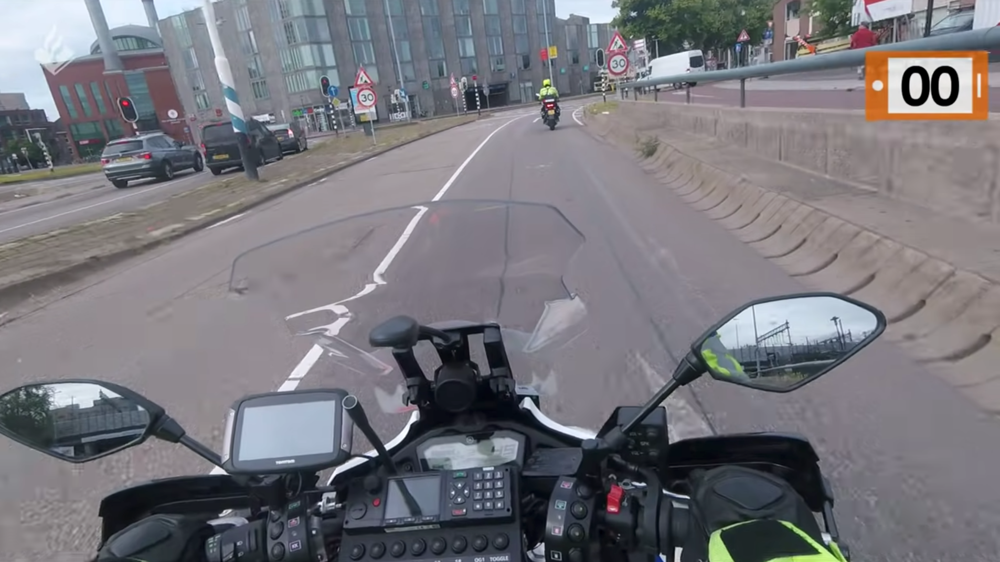

# Scenario's

Voordat een agent in de SCENR App terecht komt, bepaald&#x20;

## Agent op voet

 (1).png>)

Voor een agent op voet is makkelijk om een kentekenplaat te scannen en hiervan data op te vragen. Hij / zij kan simpelweg zijn mobiel erbij pakken, een kenteken scannen en deze doorvoeren naar de SCENR app.&#x20;

## Agent op motor

Voor een agent op de motor is het scannen van een voertuig al een stuk lastiger. Omdat zo'n motor een snelheid van zo'n 200 km/h kan bereiken, is het herkennen van een kenteken al een stuk lastiger als je onderweg bent. Bovendien&#x20;

## Agent in auto

.png>)
