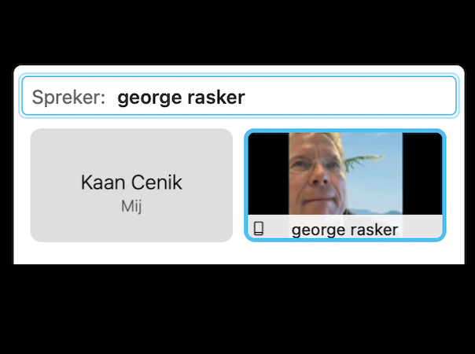

# Interview 01

**Naam geïnterviewde:** George Rasker \
**Beroep:** Programmadirecteur aanpak ondermijning \
**Methode:** Online (Cisco Webex)

## Proces

Interviewer **(Q)**: Kaan Cenik \
__Geïnterviewde **(A)**: George Rasker

❗ Een aantal vragen en antwoorden zijn verkort naar een duidelijkere uitleg.

Q: Hi George, ik ben Kaan, ... . Voor mijn afstudeerproject vanuit school hou ik mij bezig met het maken van een middel die de politie zou ondersteunen met het verminderen van autofrauders. Als het goed is weet u, als één van de opdrachtgevers hier meer over. Kunt u mij vertellen hoe groot het probleem is op het gebied van autofraude?

A: Enorm groot, vaak zelfs groter dan men dat verwacht.

Q: En hoe vaak vindt zo'n vervalsing of diefstal op een autokenteken plaats?

A: De exacte cijfers weet ik zelf ook niet precies, wel kan ik je zeggen dat in Nederland jaarlijks zo'n 150.000 tot 400.000 voertuigen worden gestolen/vervalst.

Q: Zijn er manieren om dit te verminderen? Bestaat er al iets op het markt?

A: In een artikel die ik (samen met 2 collega's) schreef, genaamd 'Kenteken aan de Wand', heb ik het over effectievere & efficiëntere manieren waarop voertuigcriminaliteit kan worden opgespoord en voorkomen. En dat de Scanauto deze informatiepositie bovendien een enorme boost kan geven. Maar helaas heeft een Scanauto wel beperkingen en zou het veel handiger aangepakt kunnen worden.

_Hieronder het stukje tekst van zijn publicatie._

.png>)

Q: Zelf kwamen wij op het idee om een app te maken voor de Politie die beschikbaar is voor op de mobiel, zijn er functies vanuit uw kant dat er minimaal in moeten?

A: Het zou handig zijn als het makkelijk te gebruiken is, stel een agent op de motor wil een scan uitvoeren, dan gaat dat niet even makkelijk als iemand op voet. Dus ik zou vooral letten op toegankelijkheid.

Q: Zijn er nog andere stakeholders die betrokken kunnen worden bij mijn oplossing?

A: Ik zou voorlopig de Politie als je hoofd-doelgroep nemen en daaruit dan een motoragent. Want als de applicatie prima te gebruiken is voor de motoragent, zullen de andere categorieën ook moeiteloos gebruik moeten kunnen maken van de applicatie. In de toekomst zou de oplossing ook evt. gebruikt kunnen worden door handhaving. Alleen dan moet er wel naar een manier gekeken worden om veel minder data beschikbaar te maken.
