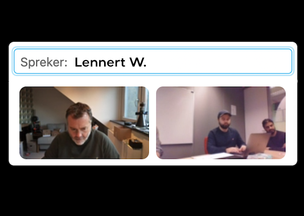

# Interview 02

**Naam geïnterviewde:** Lennert van Waal \
**Beroep:** Designer / Developer (IOS) \
**Methode:** Online (Cisco Webex)

## Proces

Interviewer **(Q)**: Kaan Cenik \
Geïnterviewde **(A)**: Lennert van Waal

❗ Een aantal vragen en antwoorden zijn verkort naar een duidelijkere uitleg.

Q: Hi Lennert, ik ben Kaan, naast mij is Shafiek (begeleider) en ... . Voor mijn afstudeerproject vanuit school hou ik mij bezig met het maken van een middel die de politie zou ondersteunen met het verminderen van autofrauders. Als het goed is bent u hier eerder al op de hoogte van gebracht. Kunt u mij vertellen wat u tot nu toe precies is verteld over dit project?

A: Hey Kaan, aangenaam. Ik heb van George ([interview met George](https://www.notion.so/Interview-01-e3217fffff7f4642af884fe446f5a002)) begrepen dat jij je de komende halfjaar bezig gaat houden met een oplossing dat de Politie (met name motoragent) zal helpen voertuigcriminaliteit te verminderen. Dit wil je dan doen met een soort van Scan app die de kentekens van voertuigen kan scannen en doorvoeren naar jullie (iCOV) systeem.

Q: Dat klopt, zou u mij meer kunnen vertellen over uw werkzaamheden?

A: Zekers, Ik heb nogal een geschiedenis op het gebied van IT en Applicatie ontwikkeling. 2 jaar bij een IT-consultancy bedrijf in Delft gewerkt als IT-beheerder, vervolgens 4 jaar als Front-end Developer bij een bureau in Amstelveen. Uiteindelijk ben ik terecht gekomen bij Apple waar ik nu al 2 jaar als App Developer werk, samen in een team met 3 anderen waarvan 2 internationaal zijn.

Q: Klinkt als een leuke avontuur! De reden dat ik met u contact heb opgenomen is namelijk omdat wij van plan zijn om de oplossing uiteindelijk op de mobiel te ontwikkelen. Daarbij is het van belang dat de applicatie zou gebruikersvriendelijk en toegankelijk mogelijk is. Als je namelijk als motoragent gebruik wil maken van de applicatie, wil je het liefst dat dat zo snel & simpel mogelijk gaat. Zijn er tips vanuit uw kant die mij als ontwerper zou kunnen helpen bij het realiseren van een applicatie die voldoet aan deze wensen?

A:
