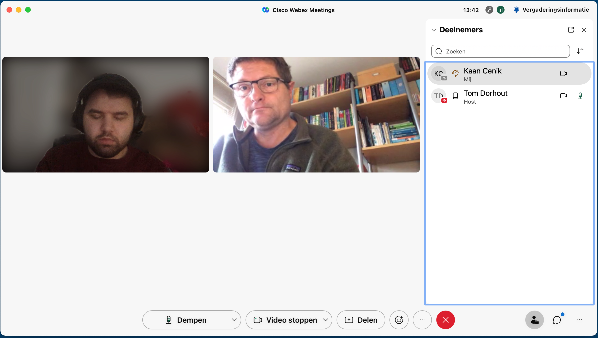

# Interview 03

**Naam geïnterviewde:** Tom Dorhout \
**Beroep:** iCOV IT-beheerder \
**Methode:** Online (Cisco Webex)

## Proces

Interviewer **(Q)**: Kaan Cenik \
Geïnterviewde **(A)**: Tom Dorhout

❗ Een aantal vragen en antwoorden zijn verkort naar een duidelijkere uitleg.

Q: Hi Tom, ik ben Kaan, ... . Voor mijn afstudeerproject vanuit school hou ik mij bezig met het maken van een middel die de politie zou ondersteunen met het verminderen van autofrauders. Ik had een aantal vragen op het gebied van persoonsgegevens en wat wel en niet weergeven mag worden in de oplossing. Zou jij mij kunnen helpen op dit gebied?

A: Hey Kaan, zeker weten. Vraag maar raak.

Q: Allereerst, wat zijn persoonsgegevens precies, wat houdt dit in?

A: Een persoonsgegeven is elk gegeven dat over een geïdentificeerde of identificeerbare natuurlijke persoon bekend is'. Simpel gezegd: persoonsgegevens zijn de gegevens waarmee men een specifiek persoon binnen een bepaalde groep kan aanwijzen.

Q: Oké duidelijk. Waar moeten organisaties (politie en dergelijken) zich aan houden en welke informatie mogen zij weergeven.

A: Organisaties en bedrijven moeten altijd duidelijk maken wat ze met uw persoonsgegevens doen. Online gebeurt dit meestal in een privacystatement. Deze informatieplicht staat in de Algemene verordening gegevensbescherming (AVG). De AVG stelt specifieke eisen aan de informatie die organisaties moeten geven.

Q: Wat staat er precies in zo'n privacystatement?

A: In de privacyverklaring staat beschreven hoe men omgaan met je gegevens. Ook lees je wat je rechten zijn met betrekking tot je eigen persoonsgegevens en hoe je hier gebruik van maakt. Zo kun je jouw gegevens laten wijzigingen en heb je recht op het bekijken van je gegevens.

* Over welke informatie beschikt mijn stakeholders op het gebied van voertuigcriminaliteit?
* Hoe gebruikt een agent technologie tijdens het werk?
* Welke informatie heb ik nodig om mijn oplossing te kunnen monitoren?
* Zijn er nog andere stakeholders die betrokken kunnen worden bij mijn oplossing?
* Waar moeten organisaties zich aan houden?
* Wat is de beste oplossing in de vorm van een app (welke functies moeten erin. Wat niet.)?
