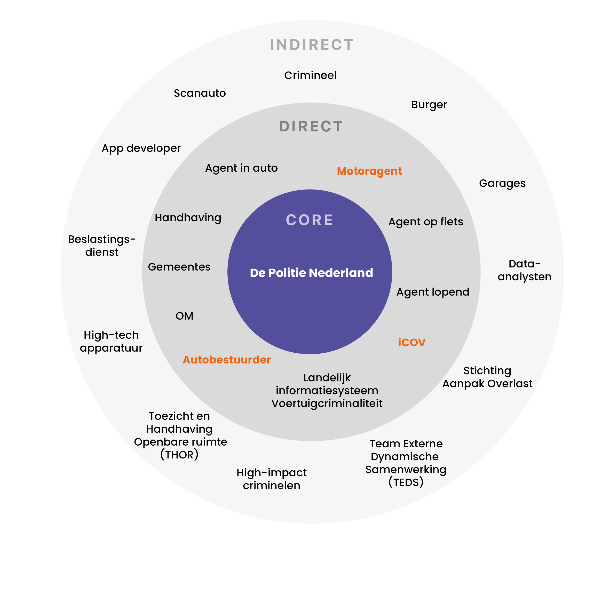

# Stakeholdermap

## Stakeholder map

Om de behoeftes van de betrokken stakeholders in kaart te brengen heb ik een stakeholder map gemaakt. Deze heb ik opgedeeld in 3 categorieën:

* Core: De belangrijkste stakeholder van het project
* Direct: Stakeholders die een directe link hebben tot het project
* Indirect: Stakeholders die een indirecte link hebben tot het project

In de Stakeholder map heb ik met een oranje kleur al aangegeven waar mijn focus binnen dit project zal liggen. Mijn oplossing is daarom ook vooral gericht voor deze stakeholders. Meer informatie over deze stakeholders kan je vinden op: [**Belangrijkste stakeholders**](belangrijkste-stakeholders.md)
