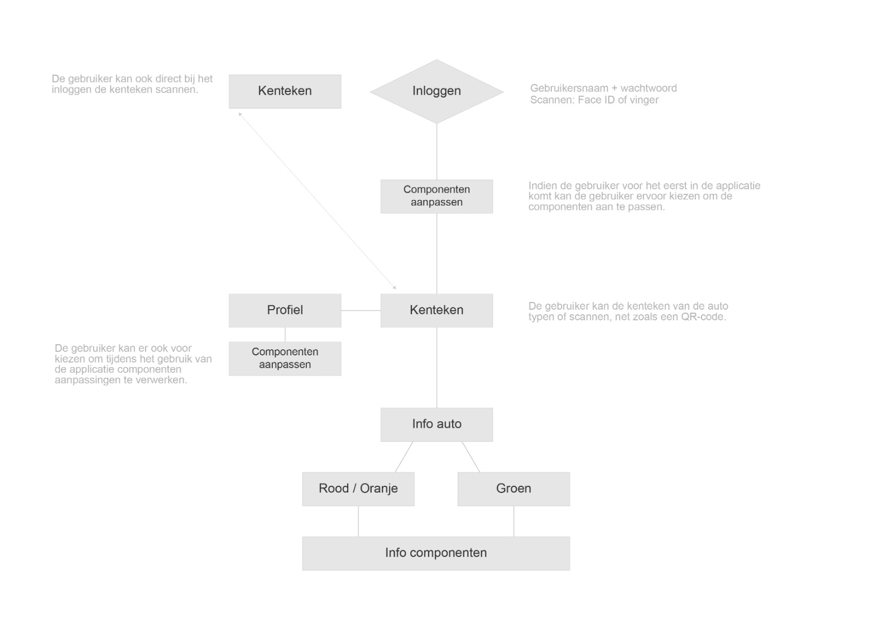
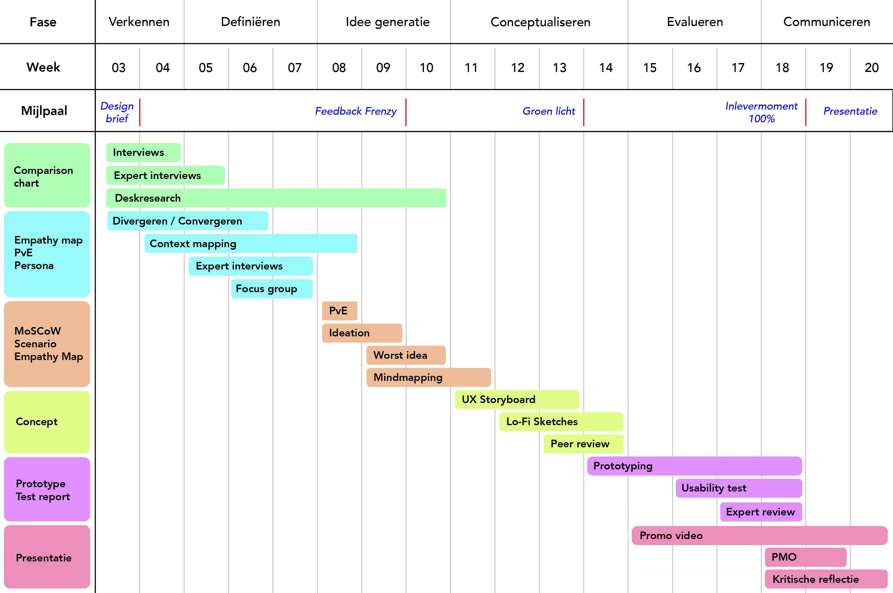

# Design Brief

## Aanleiding

Tijdens semester 1 van mijn vierde jaar als CMD student, loop ik stage bij een bedrijf genaamd **iCOV**. Gedurende mijn stage heb ik mijn skills die ik in de afgelopen jaren heb opgedaan, kunnen toepassen in de praktijk. Zo heb ik mijn kennis en ervaring op het gebied van zowel ontwerpen als ontwikkelen, enorm verbeterd. Samen met iCOV hebben we zo ook besloten om mijn afstudeerproject ook bij hen te doen.

### Wie is iCOV?

Criminelen willen het geld dat zij illegaal hebben verdiend, meestal legaal kunnen uitgeven. Om dat te kunnen, lopen ze het risico dat het verdiende geld in beslag genomen kan worden door de belastingdienst of justitie. Het gaat dan om geld dat bijvoorbeeld afkomstig is van diefstal, drugshandel, fraude en meer. Een veel voorkomend oplossing is om geld dan wit te wassen. Witwassen is het verbergen en/of een schijnbaar legale status geven aan een voorwerp (meestal geld of goederen) dat afkomstig is uit een misdrijf (_Witwassen_, z.d.).

Een van de manieren om dergelijke misstanden te voorkomen, is via de **infobox Crimineel en Onverklaarbaar Vermogen** (iCOV). iCOV is in 2013 tot leven geroepen na een verzoek van het ministerie van Justitie en Veiligheid om tot een datagedreven organisatie te komen die bijdraagt aan de bestrijding van witwassen en belastingontduiking.

[Video - iCOV in het kort](https://icov.nl/wp-content/uploads/2018/06/iCOV\_explanimation\_Klik-hier\_1.mp4)

Inmiddels is iCOV 8 jaar verder en heeft zich ontwikkeld tot een organisatie van meerdere instanties. Het gaat hierbij om o.a. de Politie, Belastingdienst, OM en veel meer. Gezamenlijk houden deze instanties zich bezig met het traceren van crimineel en/of onverklaarbaar vermogen en met het tegengaan van witwasconstructies en belastingontduiking (_Jaarverslag_, 2018).

### Wat doet iCOV precies?

iCOV Verstrekt data gedreven rapportages aan organisaties binnen het samenwerkingsverband. Dit zijn rapportages die partners van iCOV op basis van informatie klaarzetten. Deze rapportages maken inzichtelijk waar het criminele of fiscaal ontdoken vermogen wordt verborgen. iCOV onderscheidt daarbij drie type rapportages:

* De iCOV Rapportage Vermogen en Inkomen (iRVI): een financieel paspoort van een persoon of bedrijf
* De iCOV Rapportage Relaties (iRR): een overzicht van de financiële en zakelijke relaties van een persoon of bedrijf of tussen personen of bedrijven
* De iCOV Rapportage Thema (iRT): een inzicht in de risico’s op witwassen via vastgoed in een bepaald geografisch gebied.

## Persoonlijke focus

Binnen iCOV ben ik de Front-end Developer. Een front-end developer is iemand die verantwoordelijk is voor de technische kant van het front-end (de voorkant) van een applicatie, website of programma. Hij of zij zorgt in feite voor de verbinding tussen het design en de programmatuur die nodig is om het te laten functioneren.

Ik ben ervan overtuigd dat dit project een ideale manier is om mijn ontwikkelingen binnen de ontwerp en ontwikkel wereld verder uit te breiden. Zo kan bezig zijn met onderzoek doen naar een gewenste oplossing, en tegelijkertijd met product development mijn vaardigheden verbeteren. Ook kan ik de methodes die ik ga gebruiken tijdens mijn proces beter onthouden voor in de toekomst en mijzelf verbeteren op de minpunten die gedurende dit project zullen plaatsvinden.

## Probleemsituatie

Nederland loopt jaarlijks zo'n 22 miljard euro mis door belastingontduiking (Nieuws, 2019). Belastingontduiking is fraude met betrekking tot belastingen. Door een onjuist beeld van de werkelijkheid aan de autoriteiten voor te schotelen, wordt ten onrechte minder of geen belasting geheven. Dit kan op verschillende manieren plaatsvinden, bijvoorbeeld door meerdere vastgoederen aan te schaffen, of door (dure) auto's op de naam van familie en/of vrienden te kopen.

Daarnaast staat autodiefstal niet op zichzelf. Criminele organisaties maken veelvuldig gebruik van gestolen voertuigen en valse, vermiste of gestolen kentekenplaten. _High impact_ criminelen hanteren daarbij vaak de zogenaamde 'duplo-methode': ze laten een onopvallende auto stelen (Renault Clio's en Meganes zijn bijvoorbeeld populair), zoeken een vergelijkbare auto in dezelfde kleur op het internet en laten de kentekenplaten ervan namaken. Op die manier kunnen ze zich verschuilen achter de identiteit van de eigenaar van de vergelijkbare auto.

De focus bij iCOV ligt daarom nu vooral op autofraude en ze zoeken hier een oplossing voor om het te verminderen. Voor de oplossing is het handig als er ook gekeken worden naar de gebruiksvriendelijkheid. Als je bijvoorbeeld als motoragent gebruik wil maken van de digitale oplossing, moet je eerst je handschoenen afdoen, vervolgens inloggen om erin te komen en dan pas kan je een auto scannen. Als de auto op snelheid is, is dit proces al meestal niet haalbaar. Daarom zal er gekeken moeten worden naar manieren om de oplossing makkelijker toegankelijk te maken (zoals voice-control, face-scan etc.).

## Design Challenge

> Hoe kan ik doormiddel van een digitale oplossing, verschillende overheidsorganisaties waaronder vooral de Politie, helpen bij het bestrijden van onder autofraudeurs. Dit in de vorm van een middel die kentekens scant.

### Deelvragen

1.  **Met welke digitale oplossing kan ik de overheidsorganisaties helpen?**

    1. Op welke device(s) moet de oplossing gemaakt worden.
    2. Behoort de oplossing tot de behoeftes van de potentiële gebruikers?
    3. Hoe werkt de oplossing?

    Allereerst moet er een **korte onderzoek** (desk-research) gedaan worden op welke device(s) de oplossing uiteindelijk gemaakt gaat worden. Hierbij kan ik alvast weten of het responsive moet zijn. Vervolgens is het ook belangrijk om te kijken naar de behoeftes van de potentiële gebruikers. Waar moet de oplossing uiteindelijk uit bestaan en wat is overbodig? Antwoorden op deze vragen kan ik vooral achterhalen uit **(expert) interviews**. Vanuit deze interviews kan ik vervolgens de eisen van de gebruiker in een lijst zetten (Programma van Eisen). Ook kan ik een persona maken die me telkens zal herinneren wie de eindgebruiker is en wat zijn/haar wensen zijn.
2.  **Welke data is gevoelig en op welke gegevens moet ik letten tijdens het maken van de digitale oplossing?**

    * \[x] Beter profileren > Vraag beter formuleren
    * Moet de oplossing toegankelijk zijn voor iedereen?
    * Welke consequenties zijn er mogelijk?
    * Moet er verschillende versies gemaakt worden per overheidsorganisatie?

    Omdat we te maken hebben met gegevens van mensen is het natuurlijk niet geschikt om deze zomaar vrij te geven. Daarom moet er eerst een nader onderzoek gedaan worden naar de veiligheid en privacy binnen de oplossing. Het kan namelijk voorkomen dat een datalek kan plaatsvinden. Bij een datalek gaat het om toegang tot of vernietiging, wijziging of vrijkomen van persoonsgegevens bij een organisatie, zonder dat dit de bedoeling is van deze organisatie.
3.  **Welke gegevens moeten er worden achterhaald van een persoon?**

    1. Hoe weet de gebruiker wanneer een voertuig niet betaalbaar is voor de eigenaar ervan?
    2. Waar moet op gelet worden bij het achterhalen van de gegevens?
    3. Welke connecties moeten gelegd worden met de gegevens die beschikbaar zijn?

    Nadat een scan wordt uitgevoerd wordt er connecties gemaakt via iCOV met de gegevens van de eigenaar. Vanuit hier moet er vervolgens achterhaald kunnen worden onder wiens naam de auto officieel staat en of hij dit wel kan betalen. Dit kan achterhaald worden door bijvoorbeeld naar de jaarsalaris, hoeveelheid boetes en/of vastgoedwaarde te kijken van de eigenaar. Ook kan achterhaald worden of de kenteken wel een geldige is en dus de auto niet vervalst is.
4.  **Welke oplossingen bestaan er al en wat kan ik hieruit halen?**

    1. Zijn deze handig voor mijn stakeholders?
    2. Hoe werken deze oplossingen?

    Een goede voorbeeld is bijvoorbeeld _Cition_, waar ik een maatschappelijke stage heb gelopen in de verleden. Cition scant auto's om te kijken of ze wel hebben betaald om te parkeren waar ze geparkeerd zijn. Hetzelfde vorm van scannen zou ik uiteindelijk ook in mijn oplossing kunnen gebruiken, alleen dan met andere doeleinden. Zo zijn er genoeg andere oplossingen waar naar gekeken kan worden.

## Productvisie

De oplossing gaat uit naar een app voor op de mobiel, met voorkeur IOS. Dit met name omdat de app op straat door de politie gebruikt zal worden. De reden dat de voorkeur op IOS ligt, is omdat de politie al voorbestemd is met IOS-apparatuur. Daarnaast krijg ik ook steun van een app-developer die bij Apple werkt. Samen met hem zal er gekeken worden naar de mogelijkheden en opties die de app zal bieden. Ook om het misschien uiteindelijk op de markt te zetten voor de overheidsorganisaties.

Zo zijn we na wat besprekingen uitgekomen op een app, die voor nu de naam SCENR heeft. SCENR is een app die het mogelijk maakt om de kentekens van auto's te scannen. Nadat je een scan uitvoert, wordt gegevens van het persoon onder wiens naam het auto geregistreerd staat weergeven. Deze gegevens worden weergeven in de vorm van componenten. Een component kan bijvoorbeeld zijn de jaarsalaris van een persoon. Stel een persoon verdient €30.000,- per jaar maar heeft een auto t.w.v. €80.000,- op zijn naam, dan gaan er al gelijk wat lichtjes branden. In dit geval kleurt de component dan rood en mocht het zo zijn dat er meerdere componenten rood kleuren, kan er een melding gedaan worden.

Vanuit de bovenstaande flowchart heb ik al een paar eerste schetsen gemaakt. Dit geeft mij een betere look and feel van wat ik uiteindelijk naar voren moet brengen.

 (1).png>)

## Valideren van het niveau

Ik denk dat mijn project valt onder 'Excelleren', omdat ik grotendeels zelf de verantwoording draag voor het initiëren, plannen, uitvoeren en waar nodig bij stuur om de te nemen stappen. Ook reflecteer ik continue op de kwaliteit van mijn werk, de gemaakte keuzes en opgeleverde producten/documenten én de plaats van handelen en product als ontwerper/ontwikkelaar binnen het CMD-beroepenveld.

.png>)

## Mogelijke impact product

Een grote positieve impact dat mijn product kan hebben, is dat belastingontduikers met een flink aantal verminderd worden. Om te beginnen misschien alleen in Nederland, maar uiteindelijk ook in de hele EU. Binnen de gehele EU kost het belastingontduiking naar schatting ruim 823 miljard namelijk (Nieuws, 2019).

Als ik het product bekijk vanuit de etnische kant, zijn er aardig wat consequenties die er voorkomen. Het gaat namelijk om data van personen wat opgevraagd wordt binnen de app. Dit is gevoelige data en uitermate is het tegen de wet om dit openbaar te maken. Daarom is het voor in mijn proces handig als ik met _dummy_ data aan de slag ga. Dat houdt in dat het allemaal nep data is en niet echt op de naam is van een echt persoon.

## Belangrijkste mijlpalen en planning

## Bronnen

* Jaarverslag. (2018). iCOV.[https://icov.nl/wp-content/uploads/2019/08/2\_2018jaarverslag.pdf](https://icov.nl/wp-content/uploads/2019/08/2\_2018jaarverslag.pdf)
* Accountant. (2019, 23 januari). “Belastingontduiking kost Nederland 22 miljard”. [Accountant.nl](http://accountant.nl).[https://www.accountant.nl/nieuws/2019/1/belastingontduiking-kost-nederland-22-miljard/](https://www.accountant.nl/nieuws/2019/1/belastingontduiking-kost-nederland-22-miljard/)
* Video 1. iCOV in het kort. (2018). \[Video]. iCOV.[https://icov.nl/wp-content/uploads/2018/06/iCOV\_explanimation\_Klik-hier\_1.mp4](https://icov.nl/wp-content/uploads/2018/06/iCOV\_explanimation\_Klik-hier\_1.mp4) Geraadpleegd op 20 september 2021
* Witwassen. (z.d.). AMLC. Geraadpleegd op 20 september 2021, van[https://www.amlc.nl/witwassen/](https://www.amlc.nl/witwassen/)
